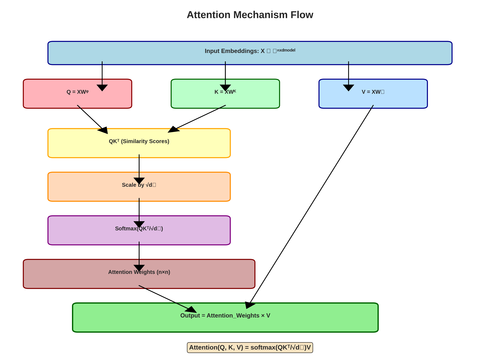
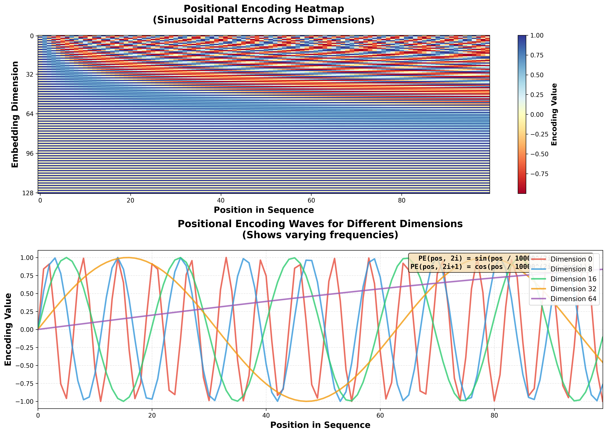

# Transformer Networks

## Introduction to Transformer Architecture

Transformers represent a revolutionary neural network architecture introduced by Vaswani et al. in their groundbreaking 2017 paper "Attention is All You Need." Unlike traditional sequence modeling approaches such as Recurrent Neural Networks (RNNs) and Long Short-Term Memory (LSTM) networks, Transformers rely entirely on attention mechanisms to capture dependencies within sequences. This fundamental design choice eliminates the sequential processing constraint, enabling full parallelization during training and achieving state-of-the-art performance across diverse natural language processing and sequence-based tasks.

The architecture addresses critical limitations of predecessor models: RNNs suffer from vanishing gradients and sequential processing bottlenecks, while CNNs require deep layer stacking to capture long-range dependencies. Transformers overcome these challenges through self-attention mechanisms that compute relationships between all sequence positions simultaneously, providing constant-length paths for information flow and enabling efficient parallel computation.

## Core Architecture Components

### Encoder-Decoder Structure

The Transformer architecture follows an encoder-decoder paradigm designed for sequence-to-sequence tasks:

**Encoder Stack:**
- Composed of N identical layers (typically N=6)
- Each layer contains two sub-layers:
  - Multi-head self-attention mechanism
  - Position-wise fully connected feed-forward network
- Processes entire input sequences in parallel
- Generates contextualized representations for each input token

**Decoder Stack:**
- Also consists of N identical layers
- Contains three sub-layers per layer:
  - Masked multi-head self-attention (prevents attending to future positions)
  - Multi-head cross-attention over encoder outputs
  - Position-wise feed-forward network
- Generates output sequences autoregressively

Both encoder and decoder employ residual connections around each sub-layer, followed by layer normalization to stabilize training dynamics and facilitate gradient flow.

### Self-Attention Mechanism

Self-attention forms the cornerstone of Transformer architecture, enabling the model to weigh the importance of different positions in a sequence when processing each element.

**Query, Key, and Value Vectors:**

For each input token, three vectors are computed through learned linear transformations:

- **Query (Q):** Represents what information the token seeks from other tokens
- **Key (K):** Represents what information the token offers for matching
- **Value (V):** Represents the actual information to be aggregated

Given input matrix X ∈ ℝ^(n×d_model) where n is sequence length and d_model is embedding dimension:

```
Q = XW_Q,  K = XW_K,  V = XW_V
```

where W_Q, W_K, W_V ∈ ℝ^(d_model×d_k) are learned weight matrices.

**Scaled Dot-Product Attention:**

The attention mechanism computes weighted sums of value vectors, with weights determined by query-key compatibility:

```
Attention(Q, K, V) = softmax(QK^T / √d_k)V
```

**Computational Steps:**
1. **Compute Similarity:** Calculate dot products QK^T ∈ ℝ^(n×n)
2. **Scale:** Divide by √d_k to prevent gradient vanishing when d_k is large
3. **Normalize:** Apply softmax row-wise to obtain attention weights summing to 1
4. **Aggregate:** Multiply attention weights by value vectors to produce output

The scaling factor √d_k is critical because dot products grow in magnitude with dimension, potentially pushing softmax into regions with vanishingly small gradients.



### Multi-Head Attention

Multi-head attention extends self-attention by learning multiple representation subspaces in parallel, enabling the model to attend to different types of relationships simultaneously.

**Architecture:**

Instead of single attention with d_model-dimensional keys, queries, and values, multi-head attention:

1. Projects Q, K, V into h different learned subspaces (heads), each with dimension d_k = d_model/h
2. Performs scaled dot-product attention in parallel for each head
3. Concatenates outputs
4. Applies final linear projection

**Mathematical Formulation:**

```
MultiHead(Q, K, V) = Concat(head_1, ..., head_h)W_O

where each head_i = Attention(QW_i^Q, KW_i^K, VW_i^V)
```

**Benefits:**
- Different heads specialize in different relationship types (syntactic, semantic, positional)
- Increases model capacity without significant computational overhead
- Provides representational redundancy and robustness

### Positional Encoding

Since Transformers process all tokens in parallel without inherent sequential structure, positional information must be explicitly injected to preserve token order.

**Sinusoidal Positional Encoding:**

The original Transformer uses sinusoidal functions to generate fixed positional encodings:

```
PE(pos, 2i) = sin(pos / 10000^(2i/d_model))
PE(pos, 2i+1) = cos(pos / 10000^(2i/d_model))
```

where:
- pos: position index in the sequence
- i: dimension index
- d_model: embedding dimension

**Properties:**
- Each dimension corresponds to a sinusoid with wavelength forming geometric progression
- Enables learning to attend by relative positions
- Generalizes to sequence lengths unseen during training
- Deterministic (no learned parameters required)

The positional encoding is added element-wise to input embeddings before the first encoder layer.



### Position-Wise Feed-Forward Networks

Each Transformer layer includes a fully connected feed-forward network applied identically to each position:

```
FFN(x) = ReLU(xW_1 + b_1)W_2 + b_2
```

**Characteristics:**
- Two linear transformations with ReLU activation
- Typically expands dimension to 4×d_model in hidden layer
- Processes each position independently with shared parameters
- Adds non-linearity and transformation capacity

### Residual Connections and Layer Normalization

**Residual Connections:**

Each sub-layer is wrapped in a residual connection:

```
Output = LayerNorm(x + Sublayer(x))
```

This design:
- Facilitates gradient flow during backpropagation
- Enables training of very deep networks
- Provides identity mapping baseline

**Layer Normalization:**
- Normalizes activations across feature dimension
- Stabilizes training dynamics
- Applied after residual addition

## Why Transformers Excel at Pattern Recognition

Transformers demonstrate superior pattern recognition capabilities through several key mechanisms:

1. **Global Context Modeling:** Every token directly attends to every other token, enabling pattern detection regardless of distance without information bottlenecks from sequential processing.

2. **Learned Hierarchical Representations:** Multi-head attention automatically learns diverse pattern detectors, with hierarchical representations emerging through layer stacking.

3. **Architectural Flexibility:** Easily scales to billions of parameters and transfers well across domains (language, vision, audio, time-series sequences).

4. **Computational Efficiency:** Parallel processing enables training on massive datasets with effective utilization of modern hardware accelerators.

5. **Attention-Based Interpretability:** Attention weights provide insights into which patterns the model considers important for specific predictions.

## Applications in Cybersecurity

### Application 1: Network Intrusion Detection

**Problem Overview:**

Network intrusion detection systems (NIDS) must identify malicious activities by analyzing patterns in network traffic flows. Traditional signature-based methods fail against zero-day attacks and polymorphic malware. Modern intrusion detection requires understanding temporal patterns and contextual relationships across packets, sessions, and protocols.

**Data Characteristics:**

Network traffic data includes:
- Packet-level features: Protocol types, flags, packet sizes, inter-arrival times
- Flow-level features: Duration, byte counts, packet counts, port numbers
- Session sequences: Ordered sequences of flow records with temporal dependencies
- Protocol behavior: State transitions, request-response patterns, payload characteristics

Datasets such as CICIDS2017, NSL-KDD, and UNSW-NB15 provide labeled network flows with attack categories including DoS, DDoS, port scanning, brute force, and SQL injection.

**Why Transformers Are Suitable:**

Traditional machine learning approaches (Random Forests, SVMs) treat each flow independently, ignoring temporal attack patterns. RNNs struggle with long sequences of network events. Transformers excel because:

- **Long-range Dependency Modeling:** Multi-stage attacks span many flows; self-attention captures dependencies across entire sessions
- **Parallel Processing:** Efficiently processes thousands of concurrent network flows
- **Multi-head Specialization:** Different attention heads specialize in different attack signatures, protocol anomalies, and temporal patterns
- **Contextual Understanding:** Learns normal behavior patterns and identifies deviations

**Model Architecture:**

| Component | Configuration |
|-----------|--------------|
| Input | Sequences of network flow feature vectors (100 consecutive flows) |
| Embedding Layer | Projects flow features into dense representations |
| Positional Encoding | Preserves temporal ordering of flows |
| Transformer Encoder | 6-layer architecture with 8 attention heads |
| Classification Head | Binary (normal/malicious) or multi-class attack categorization |
| Output | Probability distribution over attack types per flow |

**Implementation Details:**

| Component | Configuration |
|-----------|--------------|
| Sequence Length | 50-200 flows |
| Feature Dimension | 40-80 features per flow |
| Model Dimension | 256-512 |
| Attention Heads | 8-16 |
| Encoder Layers | 4-8 |
| Training Data | Millions of labeled flow sequences |

**Real-World Impact:**

- **Detection Accuracy:** Transformers achieve 98%+ accuracy on benchmark datasets, outperforming traditional ML by 5-10%
- **Zero-Day Detection:** Attention mechanisms identify novel attack patterns through anomaly detection in learned normal behavior
- **Explainability:** Attention weights reveal which flows contributed to attack classification, aiding incident response
- **Scalability:** Processes high-throughput enterprise networks (10Gbps+) with GPU acceleration

**Deployment Considerations:**
- Real-time inference requires model optimization (quantization, pruning)
- Integration with SIEM systems for automated alert generation
- Continuous retraining on evolving threat landscapes

### Application 2: Malware Classification via Static Code Analysis

**Problem Overview:**

Malware evolves rapidly through obfuscation, polymorphism, and metamorphic techniques, evading signature-based antivirus detection. Modern malware analysis requires understanding semantic relationships in assembly code, API call sequences, and control flow patterns. Static analysis must identify malicious intent without executing potentially harmful code.

**Data Characteristics:**

Static malware analysis datasets include:
- **Assembly instruction sequences:** Disassembled binary code as ordered opcodes
- **API call sequences:** Imported system functions revealing capabilities (file operations, network access, registry modifications)
- **Control flow graphs:** Structural patterns in program execution paths
- **String literals:** Embedded URLs, IP addresses, encryption keys

Datasets such as Microsoft Malware Classification Challenge, EMBER, and SOREL-20M contain labeled malware samples across families (ransomware, trojans, worms, spyware).

**Why Transformers Are Suitable:**

Traditional static analysis uses n-gram features or hand-crafted signatures. Deep learning approaches like CNNs capture local patterns but miss long-range semantic relationships. Transformers provide:

- **Semantic Code Understanding:** Self-attention learns relationships between distant code segments (e.g., data exfiltration setup and execution)
- **API Sequence Modeling:** Captures malicious behavioral patterns across long API call chains
- **Obfuscation Robustness:** Attention focuses on semantically important instructions regardless of position
- **Transfer Learning:** Pre-trained on benign code, fine-tuned for malware detection

**Model Architecture:**

- **Input:** Tokenized assembly instruction sequences or API call sequences (2000-4000 tokens)
- **Tokenization:** Vocabulary of opcodes, API names, register names, memory operations
- **Embedding:** Learned representations for each token type
- **Transformer Encoder:** 8-12 layers for deep semantic understanding
- **Pooling:** Aggregate sequence representation (CLS token or mean pooling)
- **Classification:** Dense layers for malware family prediction
- **Output:** Probability distribution over malware families and benign class

**Training Strategy:**

| Phase | Approach |
|-------|----------|
| Pre-training | Unsupervised learning on large benign code corpus (masked language modeling) |
| Fine-tuning | Supervised training on labeled malware samples |
| Data Augmentation | Instruction reordering, register renaming, NOP insertion |
| Class Imbalance | Weighted loss, oversampling rare families |
| Evaluation | Cross-validation on unseen malware variants |

**Real-World Impact:**

- **Family Classification:** Achieves 96%+ accuracy in identifying malware families, enabling targeted remediation
- **Variant Detection:** Generalizes to polymorphic variants through semantic understanding rather than exact matching
- **Automated Triage:** Prioritizes high-risk samples in security operations centers
- **Threat Intelligence:** Clustering attention patterns reveals emerging malware campaigns
- **Speed:** Analyzes thousands of samples per minute on GPU infrastructure

**Performance Comparison:**

| Method | Accuracy | Obfuscation Resistance | Speed | Explainability |
|--------|----------|----------------------|-------|----------------|
| Signature Matching | 60-70% | Low | Very Fast | High |
| Random Forest | 85-90% | Medium | Fast | Medium |
| CNN | 92-95% | Medium | Fast | Low |
| Transformer | 96-98% | High | Medium | Medium-High |

**Operational Integration:**
- Deployed in cloud malware analysis sandboxes
- Integrated with endpoint detection and response (EDR) platforms
- Supports automated quarantine decisions
- Provides detailed attribution reports for security teams

## Training and Optimization

**Training Process:**

Transformers are trained using supervised learning with key characteristics:

- **Loss Function:** Cross-entropy loss between predicted and target sequences
- **Optimization:** Adam optimizer with learning rate warm-up followed by decay
- **Regularization:** Dropout applied to attention weights, residual connections, and embeddings
- **Label Smoothing:** Prevents overconfidence in predictions
- **Parallelization:** Full sequence processed simultaneously in encoder; decoder uses teacher forcing during training

**Training Advantages:**
- Efficient GPU utilization due to parallelizable operations
- Faster convergence compared to RNNs on large datasets
- Scalability to very large models and datasets
- Effective transfer learning capabilities

## Conclusion

Transformer networks represent a paradigm shift in sequence modeling, enabling unprecedented performance through parallelizable self-attention mechanisms. Their ability to capture long-range dependencies, scale to massive datasets, and transfer across domains makes them invaluable for cybersecurity applications.

The mathematical foundations—scaled dot-product attention, multi-head mechanisms, and positional encodings—combine to create architectures that learn hierarchical, contextual representations. From network intrusion detection to malware analysis, Transformers provide the pattern recognition capabilities necessary to defend against sophisticated, evolving threats in modern attack landscapes.

As cybersecurity challenges grow in complexity with increasingly sophisticated attack vectors, Transformer-based solutions offer the accuracy, speed, and adaptability required for effective threat detection and response. Their success in natural language processing has translated remarkably well to cybersecurity domains, where understanding sequential patterns and contextual relationships is paramount for identifying malicious behavior and protecting critical infrastructure.
